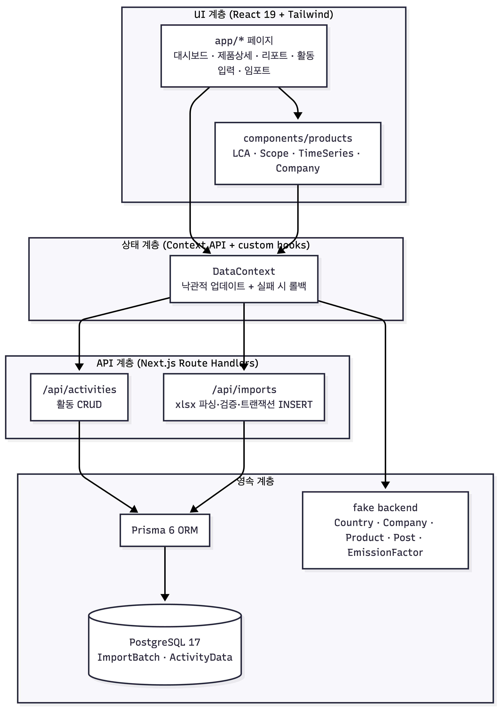
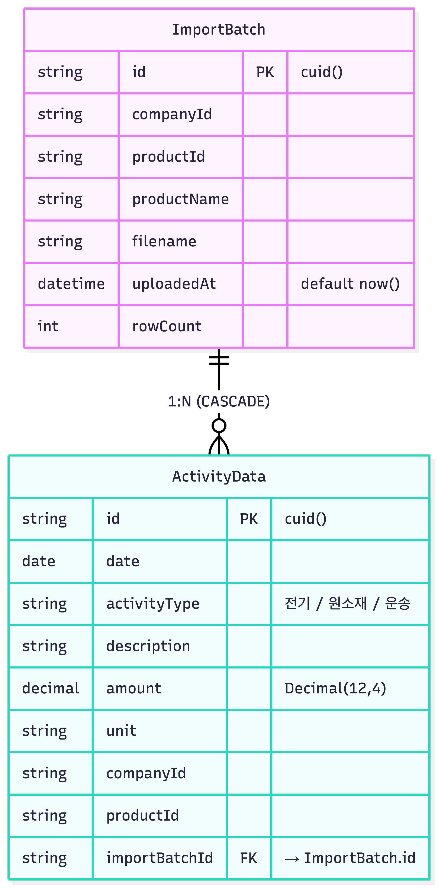
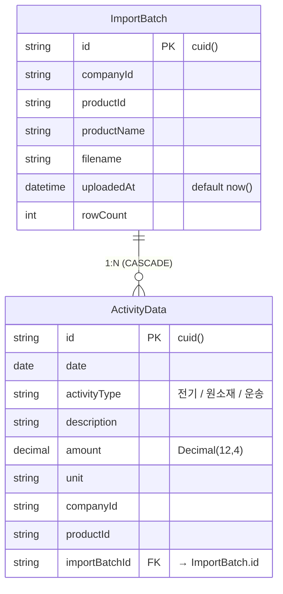

# Emissions Dashboard

 **PCF 전과정(LCA) 활동 데이터 배출량을 시각화** 하는 인터랙티브 대시보드.
Next.js 16 App Router + TypeScript + Tailwind + Recharts 로 구현.

> **핵심 해석**: 과제 데이터에 생산 수량이 없어 PCF(제품 1개당 배출량) 계산은 불가하므로,
> PCF 를 구성하는 전과정 단계별 (원료조달 / 제조 / 운송유통) 배출량을 LCA × GHG Scope 관점에서 시각화한다.
> 자세한 근거는 [decision.md #0](decision.md) 참고.

---

## 프로젝트 실행 방법 - 로컬 실행 방법 및 Swagger (*필수로 읽어주세요!)

📄 **프로젝트 문서 (Notion)**: https://pouncing-jaguar-da7.notion.site/3595d4f5ac7a800b9507c28f31ae8b34?pvs=74

📄 **Swagger 실행 안내**: https://editor.swagger.io 에 docs/openapi.yaml 파일 내용을 붙여넣으면 스웨거를 인터랙티브 미리보기 하실수 있습니다.

---

## 스크린샷 / 데모 영상

📄 **데모 영상 (Notion)**: https://pouncing-jaguar-da7.notion.site/3595d4f5ac7a806db726e6c696a3db16

---

## 사용 AI 도구 - CLAUDE CODE
> **docs 폴더에 해당 작업내역이 기록되어 있습니다.
- docs/CLAUDE.md (전체 가이드라인)
- docs/spec.md (구체적인 실행계획)
- docs/decision.md (트레이드오프)
- docs/db.md (디비 설계 관련 실행계획)
- docs/openapi.yaml (API 명세 — OpenAPI 3.0)

---

## 시스템 개요 & 설계

### 아키텍처 (계층 구조)

**부분 영속화**: 임포트 대상이 되는 활동 데이터(`ActivityData`)와 임포트 이력(`ImportBatch`)만 PostgreSQL로 영속하고, 나머지(회사·제품·국가·배출계수·Post)는 in-memory fake backend 그대로 둔다. 과제 보너스 항목인 "Excel 임포트" 의 신뢰도(트랜잭션·중복 방지) 만 PG 로 강화하고, 마스터 데이터까지 무리하게 옮기지 않는 절충안.

### 핵심 설계 결정 (요약 — 상세는 [docs/decision.md](docs/decision.md), [docs/db.md](docs/db.md))

| # | 결정 | 트레이드오프 |
|---|------|--------------|
| D0 | **PCF 계산 → 전과정 배출량 시각화로 재해석** (생산 수량 데이터 부재) | 과제 제목과 구현 사이 ambiguity → README/decision.md 에 명시적 기록 |
| D1 | **부분 PG 교체** (ActivityData/ImportBatch 만 PG, 마스터는 fake backend) | 두 개 영속소스 공존 (대신 코드 단순성·구현 시간 확보) |
| D2 | **ImportBatch 1:N ActivityData** (`onDelete: Cascade`) | 단일 테이블 대비 join 비용 ↑ — 배치 단위 롤백·이력 조회를 얻음 |
| D3 | **xlsx 검증 실패 1행 → 전체 거부 + 단일 트랜잭션** | 부분 임포트 불가 — 데이터 무결성 우선 |
| D4 | **중복 거부**: `(companyId, productId, date, activityType, description, amount)` unique | 동일 활동을 일부러 두 번 입력 불가 — 같은 날 다른 description 으로만 구분 가능 |
| D5 | **상태관리: Context API + custom hooks** (Zustand 미채택) | 보일러플레이트 ↑ — 외부 의존성 제거, 학습 곡선 ↓ |
| D6 | **낙관적 업데이트 + 실패 시 롤백** (`createOrUpdatePost` 15% 실패 시뮬레이션 대응) | 코드 복잡도 ↑ — 빠른 UI 응답 + 실패 투명성 |
| D7 | **배출계수를 `lib/constants/emissionFactors.ts` 단일 소스로 분리** (xlsx 의 H~J 컬럼 무시) | 임포트 데이터의 배출계수 컬럼이 사실상 무시됨 — 정책 변경 시 한 곳만 수정 |
| D8 | **Scope 1 = 0 명시 / 사용·폐기 = "데이터 없음" 명시** | 차트가 비어 보일 수 있음 — GHG 프레임워크 완결성 유지 |

---

## Tech Stack

| 영역 | 선택 |
|---|---|
| Framework | Next.js 16.2 (App Router, Turbopack) |
| Runtime | React 19.2 |
| Language | TypeScript 5+ |
| Styling | Tailwind CSS v4 |
| Charts | Recharts v3 |
| State | React Context API + custom hooks |
| Database | **PostgreSQL 17** (docker-compose, 포트 5433) |
| ORM | **Prisma 6** (마이그레이션 기반 스키마 관리) |
| API | Next.js Route Handlers (`/api/activities`, `/api/imports`) |
| Excel 파싱 | xlsx (SheetJS) — 헤더 3행 스킵, 행 단위 검증 + 중복 거부 |

---

## ERD

Mermaid 소스 (보기)

- **관계**: `ImportBatch` 1 : N `ActivityData` (xlsx 한 번 업로드 = 1 batch, 행 단위 = N activities). `onDelete: Cascade` — batch 삭제 시 활동 데이터 동시 제거.
- **중복 방지**: `ActivityData` 의 `@@unique([companyId, productId, date, activityType, description, amount])` 로 동일 활동 입력 차단.
- **인덱스**: `ImportBatch[companyId, productId]`, `ImportBatch[uploadedAt]`, `ActivityData[productId|companyId|date]` — 회사/제품/기간 필터 쿼리 최적화.
- **Company/Product 테이블 없음**: 본 과제 범위에서 회사·제품 마스터는 `lib/data/seed.ts` + Context 가 단일 소스 — DB 에는 ID 만 저장하고 FK 제약은 두지 않는다.

---

## 페이지 구성

| 경로 | 설명 |
|---|---|
| `/` | 대시보드 메인 — 제품 카드 (총 배출량 + Scope 2/3 비중) |
| `/products/[id]` | 제품 상세 — 4개 차트 + 월별 리포트 작성 폼 + **공통 기간 필터** |
| `/reports` | 전체 월간 지속가능성 리포트 목록 (Post) |
| `/activities/new` | 활동 데이터 입력 폼 (회사→제품 cascade, **회사·제품 신규 추가 가능**, 활동→설명/단위 자동 연동) |
| `/imports/new` | **Excel(.xlsx) 일괄 임포트** — 회사·제품 선택 후 파일 업로드 → 검증 → PostgreSQL 저장 |

`/products/[id]` 의 4개 차트는 페이지 상단 기간 필터에 동기화되어 함께 반응:
- **전과정 단계별 (LCA)** — 원료조달 / 제조 / 운송유통 도넛, 각 단계에 GHG Scope 함께 표시 (사용/폐기는 "데이터 없음")
- **GHG Scope별** — Scope 1/2/3 도넛 + 월별 스택 바, 툴팁에 LCA 단계 함께 표시 (Scope 1 = 0 명시)
- **월별 추이** — 활동 유형별 (전기/원소재/운송) 스택 바
- **회사별 비교** — 가로 스택 바 (시간 축이 아니므로 필터에 영향 없음)

---

## Assumptions

CLAUDE.md `## Assumptions` 와 동기화. 발표/제출 시 명시적으로 짚어야 할 해석:

- 과제용 데이터는 CT-045 의 2025.01~08 생산 활동 전체의 배출량으로 간주한다.
- **생산 수량 데이터가 없어 제품 1개당 PCF 계산은 포함하지 않는다.** 대신 "기간 총 배출량(kgCO₂e)" 으로 표시한다 (PCF ≠ 총 배출량).
- Scope 1 데이터가 없으므로 0 kgCO₂e 로 명시한다 (항목 자체는 표시).
- 전과정(LCA) 5단계 중 원료 조달 / 제조 / 운송유통 단계만 데이터가 제공되어 사용 / 폐기 단계는 "데이터 없음" 으로 표시한다.
- 2025-05-01 중복 데이터는 별개의 활동 기록으로 간주하여 모두 합산한다.
- 회사 c2 (Globex) 는 비교 시연용 더미로 등록된 제품이 없다 — 단, **`/activities/new` 폼에서 새 제품을 추가할 수 있다**.
- **상태관리는 React Context API + custom hooks** 로 통일 (Zustand 미사용).
- **데이터는 PostgreSQL 에 영속 저장** (이전 버전의 in-memory fake backend 에서 교체). 앱 재시작 시 데이터 유지.
- xlsx 임포트는 **회사·제품을 폼에서 선택**하고, 시트의 배출계수 컬럼은 무시한다 (배출계수는 `lib/constants/emissionFactors.ts` 단일 소스).
- 임포트 시 행 단위 검증 실패가 1건이라도 있으면 **전체 거부**하며, 동일 (회사·제품·일자·활동유형·설명·량) 조합 중복도 거부한다.

