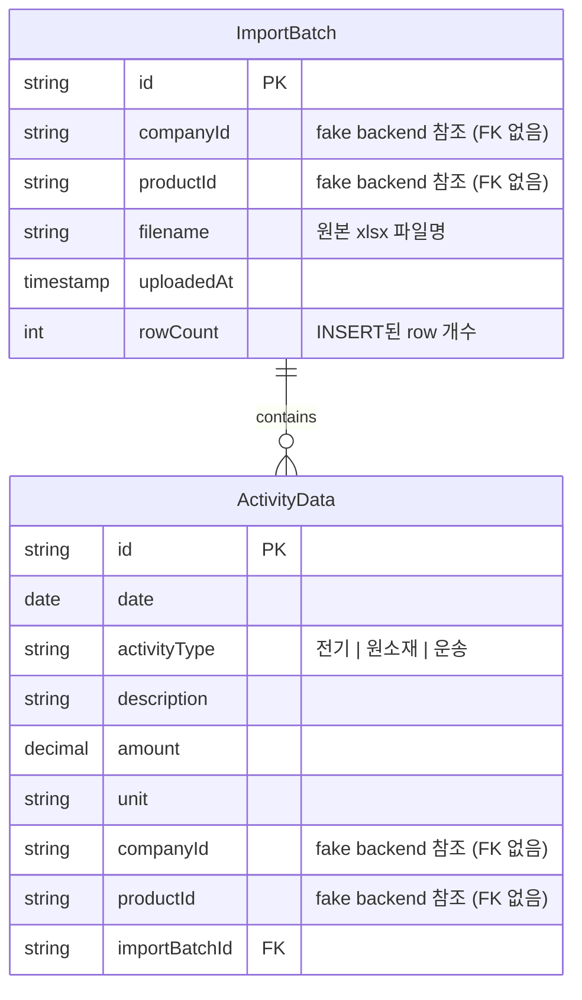

# DB 설계 결정사항

이 문서는 HanaLoop dashboard의 DB 도입에 관한 결정사항을 누적 기록한다. 결정이 추가될 때마다 갱신.

마지막 갱신: 2026-05-07

---

## 확정된 결정

### Phase 0 — 기술 스택

| # | 항목 | 결정 |
|---|------|------|
| 0-1 | DB 엔진 | **PostgreSQL** |
| 0-2 | 접근 방식 | **Prisma** (ORM) |
| 0-3 | 로컬 개발 환경 | **docker-compose**로 PostgreSQL 컨테이너 |
| 0-4 | DB 도입 목적 / fake backend 관계 | **시나리오 B — 임포트 + 임포트된 데이터 조회.** Excel로 임포트된 활동 데이터를 PostgreSQL에 저장하고, 대시보드가 PostgreSQL에서 조회. 그 외 데이터는 fake backend 유지 |
| 0-5 | PostgreSQL로 이전할 엔티티 범위 | **후보 1 — 최소 (`ActivityData`만)**. Country/Company/Product/EmissionFactor/Post는 모두 fake backend 유지. `companyId`/`productId`는 PG에 string으로 저장 (FK 제약 없음, 코드 레벨 무결성) |

### Excel 임포트 인터페이스 (보너스 항목)

과제 안내문: *"제공된 Excel 파일을 별도 가공 없이 PostgreSQL에 직접 임포트할 수 있는 인터페이스를 구현한 경우, 추가 가점을 부여합니다."*

대상 파일: 프로젝트 루트의 `과제용 데이터.xlsx`.

**구조 사실:**
- 시트 1개 (`과제용 데이터`), 33행 × 10열
- A열은 비어 있음
- 좌측(B~F): row2 헤더(`일자(원본)`, `활동 유형`, `설명`, `량`, `단위`), row3~32 활동 데이터 30행
- 우측(H~J): 배출계수 5행 (참고용)
- 같은 시트에 **두 논리 테이블이 가로로** 배치 → raw INSERT 불가, 파싱 필요

**"별도 가공 없이"의 해석:** 사용자가 받은 xlsx를 가공 없이 그대로 업로드한다는 의미로 해석. 시스템 측에서 파싱·매핑·검증을 처리.

| # | 항목 | 결정 |
|---|------|------|
| I-1 | 인터페이스 형태 | **Web UI 파일 업로드** |
| I-2 | 회사/제품 매핑 방식 | **업로드 폼에서 회사 + 제품 선택 후 xlsx 첨부** |
| I-3 | 배출계수 영역(H~J) 처리 | **무시** (참고용으로만 표시 가능) |
| I-4 | 파싱 라이브러리 | **`xlsx` (SheetJS)** |
| I-5 | 파싱 위치 | **Next.js API Route** (multipart upload → 서버 파싱 → Prisma INSERT) |
| I-6 | 중복 정책 | **거부** — 같은 (companyId, productId, date, activityType, description, amount) 조합이 이미 존재하면 새 row 거부 |
| I-7 | importBatchId 추적 | **추적함** — `ImportBatch` 테이블 도입. ActivityData에 `importBatchId` 컬럼 추가. batch 단위 롤백/이력 조회 가능 |
| I-8 | 검증 실패 처리 | **전체 롤백** — 1행이라도 검증 실패 시 임포트 취소 (0개 row INSERT, ImportBatch 생성 안 함). PostgreSQL 트랜잭션 1개로 처리 |

---

## 미결정 항목

### Phase 1 — 도메인 모호함 (PostgreSQL 스키마와 무관, UI/모델 결정)

| # | 항목 | 선택지 |
|---|------|-------|
| 1-1 | 해석 B의 UX 옵션 | 같은 이름 제품 보유 회사들 비교 뷰 추가 여부 (옵션 1=현 상태, 옵션 2=대시보드 그룹화, 옵션 3=CompanyChart 의미 수정, 옵션 4=조합) |

#### 후보 1 선택으로 자동 해소된 항목 (PostgreSQL 스키마와 무관해짐)
- **1-2** `GhgEmission` 저장 vs 파생 → ActivityData만 PostgreSQL에 있으므로 GhgEmission은 기존대로 코드에서 매번 계산 (캐시 테이블 불필요)
- **1-3** `EmissionFactor` 버전 관리 → fake backend에 그대로 남음. PostgreSQL 스키마 무관
- **1-4** 데이터 모델 출처 충돌 → Company가 PostgreSQL에 안 들어가므로 `Company.emissions[]` 임베딩 vs 정규화 논쟁 무관
- **1-5** `Country` 키 → fake backend 유지. PostgreSQL 스키마 무관
- **1-6** `Product.name` 유일성 → fake backend 유지. PostgreSQL 스키마 무관

---

## 스키마 초안 (Phase 2)

확정된 결정에 기반한 PostgreSQL 스키마. 아래 **❓ 표시 항목은 추가 결정 필요**.

### ER 다이어그램



### Prisma 스키마 초안

```prisma
generator client {
  provider = "prisma-client-js"
}

datasource db {
  provider = "postgresql"
  url      = env("DATABASE_URL")
}

model ImportBatch {
  id         String         @id @default(cuid())
  companyId  String                                       // fake backend 참조 (FK 없음)
  productId  String                                       // fake backend 참조 (FK 없음)
  filename   String
  uploadedAt DateTime       @default(now())
  rowCount   Int
  activities ActivityData[]

  @@index([companyId, productId])
  @@index([uploadedAt])
}

model ActivityData {
  id            String      @id @default(cuid())
  date          DateTime    @db.Date                       // YYYY-MM-DD
  activityType  String                                     // "전기" | "원소재" | "운송"
  description   String
  amount        Decimal     @db.Decimal(12, 4)
  unit          String
  companyId     String                                     // fake backend 참조 (FK 없음)
  productId     String                                     // fake backend 참조 (FK 없음)
  importBatchId String
  importBatch   ImportBatch @relation(fields: [importBatchId], references: [id], onDelete: Cascade)

  @@unique([companyId, productId, date, activityType, description, amount], name: "activity_dedup")
  @@index([productId])
  @@index([companyId])
  @@index([date])
}
```

### 결정 근거 (사실 매핑)

| 스키마 항목 | 근거 결정 |
|-------------|----------|
| 테이블 2개 (`ImportBatch`, `ActivityData`) | 0-5 후보 1 + I-7 추적함 |
| `companyId`/`productId`에 FK 없음 | 0-5 후보 1 (외부 데이터소스 참조) |
| `@@unique` 6개 컬럼 조합 | I-6 중복 거부 |
| `importBatchId` 컬럼 + FK 관계 | I-7 추적함 |
| `onDelete: Cascade` | batch 삭제 시 그 안의 활동 데이터도 함께 삭제 (batch 단위 롤백 의도) |
| 임포트 단위 트랜잭션 처리 | I-8 전체 롤백 (스키마가 아닌 API Route 구현 사항) |

### 세부 사항 결정 (S-1 ~ S-8)

기본값으로 알아서 채택. 모두 초안에 반영된 값과 동일하거나 표준 선택.

| # | 항목 | 결정 | 사유 |
|---|------|------|------|
| **S-1** | ID 생성 방식 | **`cuid()`** | Prisma 기본값. 짧고(24자) URL-safe. 활동 데이터 양이 많아져도 PK 충돌 위험 낮음 |
| **S-2** | `date` 컬럼 타입 | **`DateTime @db.Date`** | xlsx 원본도 시간 정보 없는 YYYY-MM-DD. 시간 컬럼 추가는 데이터에 없는 정밀도를 가짜로 만드는 것 |
| **S-3** | `activityType` 표현 | **`String`** (Prisma enum 안 씀) | 한글 값을 그대로 사용 중이고, fake backend 측 [types.ts:1](lib/types.ts#L1)의 `ActivityType` 유니온과 코드 레벨 검증으로 일관됨. enum 추가는 마이그레이션 부담만 늘림 |
| **S-4** | `amount` 타입 | **`Decimal @db.Decimal(12, 4)`** | 측정값/배출량 계산에 부동소수 오차 회피. 12자리 정밀도 + 소수 4자리면 현 데이터 범위(최대 510kg, 230 ton-km) 충분히 커버 |
| **S-5** | `ImportBatch.rowCount` | **저장** | 임포트 이력 화면에서 매번 `COUNT(*)` 하지 않아도 됨. 임포트 시 1번만 채우면 됨 (트랜잭션 안에서 자연스러움) |
| **S-6** | `onDelete` | **Cascade** | I-7에서 "batch 단위 롤백" 의도 명시됨. ImportBatch 삭제 = 그 batch의 활동 데이터 전체 삭제 |
| **S-7** | `description` 길이 제한 | **제한 없음 (`text`)** | 현재 최대 8자지만 향후 확장 여지. PostgreSQL `text`는 `varchar`와 성능 차이 없음. 인위적 제약 안 둠 |
| **S-8** | UNIQUE 위반 시 구현 방식 | **트랜잭션 + 사전 `findMany` 검증** | I-6 거부 + I-8 전체 롤백을 만족시키는 명확한 방식. 30개 row 정도는 사전 조회 부담 없음. 구현은 API Route 단계에서 다시 검토 |

### 인덱스 초안 근거

- `ActivityData.productId` 단일 인덱스 — `app/products/[id]/page.tsx:51-53`의 `productId` 필터 가속
- `ActivityData.companyId` 단일 인덱스 — 회사별 조회 (CompanyChart 등)
- `ActivityData.date` 단일 인덱스 — 시간별 차트 / 기간 필터
- `ImportBatch(companyId, productId)` 복합 — "이 제품의 임포트 이력" 조회
- `ImportBatch.uploadedAt` — 최근 임포트 정렬

---

## 변경 이력

- 2026-05-05: 최초 작성. Phase 0 (0-1~0-3) + Excel 임포트 (I-1~I-6) 확정.
- 2026-05-05: 0-4 결정 — 시나리오 B (임포트 + 임포트된 데이터 조회). fake backend는 일부 영역에 한해 유지.
- 2026-05-05: 0-5 결정 — 후보 1 (ActivityData만 PostgreSQL). Phase 1의 도메인 모호함 항목 다수 자동 해소.
- 2026-05-05: I-7 결정 — importBatchId 추적함. ImportBatch 테이블 추가.
- 2026-05-05: I-8 결정 — 검증 실패 시 전체 롤백 (트랜잭션 1개).
- 2026-05-05: 스키마 초안 추가 (Phase 2). S-1~S-8 추가 결정 필요.
- 2026-05-07: S-1~S-8 모두 기본값으로 확정. 스키마 초안이 그대로 최종안이 됨.
